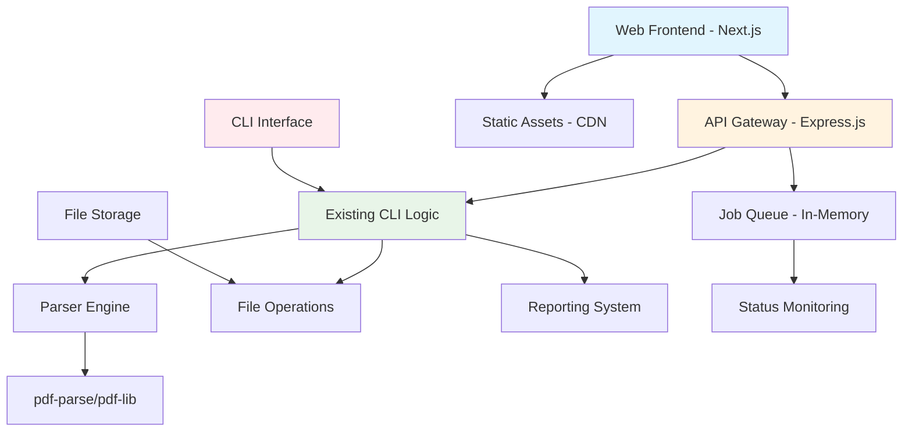

# Amazon Invoice Parser Frontend Enhancement Architecture

## Executive Summary

This document outlines the architectural approach for adding a comprehensive web frontend to the existing Amazon Invoice Parser CLI application. The enhancement maintains full backward compatibility with existing CLI functionality while introducing a modern web interface for improved user accessibility and batch processing visualization.

**Architecture Vision:** A pragmatic brownfield enhancement that adds web capabilities without disrupting the proven CLI architecture, following progressive enhancement principles.

## Existing System Analysis

### Current Architecture Overview
- **Technology Stack:** Node.js 18+, Commander.js CLI, pdf-parse for PDF processing
- **Architecture Pattern:** Modular CLI-first design with separation of concerns
- **Data Flow:** File-based JSON output, no persistent database
- **Processing Model:** Single-threaded, synchronous PDF processing
- **Output Formats:** JSON (primary), CSV, text reports

### Key Existing Components
- **Parser Engine:** Core PDF text extraction and data structuring
- **CLI Interface:** Command-line argument parsing and file operations
- **Reporting System:** Structured output generation and formatting
- **Validation Layer:** Joi-based schema validation for extracted data

### Architectural Strengths
- **Modular Design:** Clear separation between parsing, CLI, and reporting
- **Proven Reliability:** Existing parser handles multiple regions and currencies
- **Performance:** Optimized for single-file processing with <30s completion
- **Extensibility:** Factory pattern for parser selection and format support

## Enhancement Architecture

### Overall System Architecture



### Frontend Architecture

#### Technology Stack Selection
- **Framework:** Next.js 14+ (App Router) - Optimal for full-stack Node.js integration
- **Styling:** Tailwind CSS - Utility-first approach matching existing design philosophy
- **State Management:** Zustand - Lightweight, scalable for file processing workflows
- **Component Library:** shadcn/ui - Accessible, customizable components

#### Key Design Decisions
1. **Progressive Enhancement:** Web interface complements, doesn't replace CLI
2. **API-First Design:** RESTful APIs enable both web and potential mobile clients
3. **File-Based Processing:** Maintains existing JSON output compatibility
4. **Real-Time Updates:** WebSocket/sse for processing status without persistent storage

### API Layer Architecture

#### REST API Design Principles
- **Resource-Oriented:** `/api/uploads`, `/api/process`, `/api/results`
- **HTTP Status Codes:** Standard REST semantics for file operations
- **Content Negotiation:** JSON responses matching existing CLI output
- **Error Handling:** Structured error responses with CLI-compatible messages

#### Core API Endpoints
```
POST   /api/upload           # Single/batch file uploads
POST   /api/process/:jobId   # Start processing job
GET    /api/status/:jobId    # Real-time processing status
GET    /api/results/:jobId   # Retrieve processed data
DELETE /api/cleanup/:jobId   # Cleanup temporary files
```

### Backend Integration Strategy

#### CLI Wrapper Pattern
```javascript
// src/api/processing.js - API wrapper around CLI
class ProcessingAPI {
  async processFiles(jobId, filePaths, options) {
    // Wrap existing CLI.parse() method
    const results = await this.cli.processBatch(filePaths, options);
    return this.transformToAPIResponse(results);
  }
}
```

#### Key Integration Points
- **Parser Factory:** Reuse existing parser selection logic
- **Reporting System:** Leverage existing CSV/text report generation
- **File Operations:** Extend current file handling utilities
- **Validation:** Apply existing Joi schemas to API inputs

### Data Architecture

#### Processing Workflow
1. **Upload Phase:** Files stored in temporary directory with job IDs
2. **Processing Phase:** Existing parser processes files sequentially
3. **Results Phase:** JSON output stored with job metadata
4. **Cleanup Phase:** Automatic cleanup after retention period

#### Job Management
```javascript
interface ProcessingJob {
  id: string;
  status: 'uploading' | 'processing' | 'completed' | 'failed';
  files: FileMetadata[];
  results: InvoiceData[];
  created: Date;
  completed?: Date;
}
```

### Deployment Architecture

#### Hybrid Deployment Model
- **CLI Distribution:** npm package for global installation
- **Web Deployment:** Vercel/Netlify for serverless frontend + API routes
- **Shared Codebase:** Monorepo structure with conditional exports

#### Build Configuration
```json
{
  "scripts": {
    "build:cli": "pkg src/cli/cli.js --targets node18",
    "build:web": "next build",
    "build:all": "npm run build:cli && npm run build:web"
  }
}
```

## Integration Challenges & Solutions

### Challenge 1: CLI vs Web Processing Models
**Problem:** CLI processes synchronously, web needs async feedback
**Solution:** Job queue abstraction with status polling

### Challenge 2: File Upload Security
**Problem:** Web uploads introduce security concerns absent in CLI
**Solution:** File type validation, size limits, virus scanning integration

### Challenge 3: State Management
**Problem:** CLI is stateless, web needs session management
**Solution:** Job-based state with in-memory storage, file-based persistence

### Challenge 4: Error Handling Consistency
**Problem:** CLI errors differ from web expectations
**Solution:** Error transformation layer mapping CLI errors to HTTP responses

## Performance & Scalability

### Performance Targets
- **Upload Speed:** <2 seconds for file validation
- **Processing Time:** Maintain <30s per invoice (existing benchmark)
- **API Response:** <500ms for status checks
- **Memory Usage:** <500MB per concurrent job

### Scalability Considerations
- **Horizontal Scaling:** Stateless API design enables scaling
- **Resource Limits:** File size and concurrent job restrictions
- **Caching Strategy:** CDN for static assets, no data caching needed

## Security Architecture

### Input Validation
- **File Type Verification:** PDF format validation
- **Size Limits:** 50MB per file, 500MB per batch
- **Path Sanitization:** Prevent directory traversal attacks
- **Content Scanning:** Future virus/malware scanning integration

### API Security
- **Rate Limiting:** Prevent abuse of processing endpoints
- **CORS Configuration:** Restrict to allowed origins
- **Input Sanitization:** Validate all API parameters
- **Error Information:** Prevent information leakage

## Testing Strategy

### Testing Pyramid
- **Unit Tests:** Component and utility function testing
- **Integration Tests:** API endpoint testing with mock files
- **E2E Tests:** Full upload-to-results workflow testing
- **Performance Tests:** Load testing for concurrent processing

### Test Data Strategy
- **Synthetic PDFs:** Generated test files for consistent testing
- **Real Data Samples:** Anonymized production data for accuracy validation
- **Edge Cases:** Malformed PDFs, large files, encoding issues

## Monitoring & Observability

### Key Metrics
- **Processing Success Rate:** Percentage of successful extractions
- **API Response Times:** P95 response times for all endpoints
- **Error Rates:** Breakdown by error type and endpoint
- **Resource Usage:** Memory and CPU usage per job

### Logging Strategy
- **Structured Logging:** JSON format compatible with existing Winston setup
- **Log Levels:** Error, warn, info for different operational needs
- **Retention:** 30-day retention for troubleshooting

## Migration & Rollout Strategy

### Phased Implementation
1. **Phase 1:** API layer development with CLI compatibility testing
2. **Phase 2:** Frontend development with mock API integration
3. **Phase 3:** End-to-end integration and testing
4. **Phase 4:** Production deployment with feature flags

### Backward Compatibility
- **CLI Unchanged:** Existing CLI commands work identically
- **Data Formats:** JSON output remains compatible
- **Configuration:** CLI config files continue to work
- **Dependencies:** No breaking changes to existing npm dependencies

## Risk Mitigation

### Technical Risks
- **Performance Impact:** Comprehensive performance testing before deployment
- **Memory Leaks:** Automated testing for resource cleanup
- **Browser Compatibility:** Testing across target browsers
- **Mobile Responsiveness:** Device testing for responsive design

### Operational Risks
- **Increased Complexity:** Modular design prevents tight coupling
- **Deployment Issues:** Blue-green deployment strategy
- **Rollback Plan:** Ability to disable web features without CLI impact
- **Support Load:** Documentation and error handling for user support

## Success Metrics

### Technical Metrics
- **API Availability:** 99.9% uptime target
- **Processing Accuracy:** Maintain existing 95%+ accuracy
- **Response Times:** <2s page loads, <500ms API responses
- **Error Rates:** <1% processing failures

### Business Metrics
- **User Adoption:** Percentage of users switching from CLI to web
- **Processing Volume:** Increase in invoice processing capacity
- **User Satisfaction:** Reduction in support tickets for file processing
- **Time Savings:** Reduction in manual processing time

## Conclusion

This brownfield enhancement successfully adds modern web capabilities while preserving the reliability and performance of the existing CLI architecture. The hybrid approach ensures maximum flexibility for different user needs while maintaining the core strengths that have made the Amazon Invoice Parser successful.

**Key Architectural Principles:**
- **Preserve Existing Excellence:** Don't break what works
- **Progressive Enhancement:** Add capabilities without disruption
- **API-First Design:** Enable future clients and integrations
- **Performance Parity:** Web interface matches CLI performance
- **Security First:** Maintain security standards across all interfaces