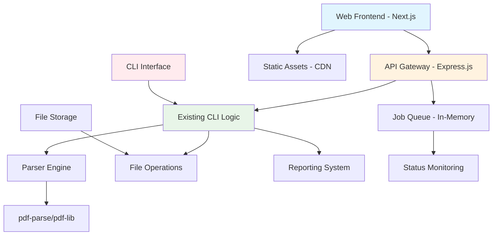

# Enhancement Architecture

## Overall System Architecture



## Frontend Architecture

### Technology Stack Selection
- **Framework:** Next.js 14+ (App Router) - Optimal for full-stack Node.js integration
- **Styling:** Tailwind CSS - Utility-first approach matching existing design philosophy
- **State Management:** Zustand - Lightweight, scalable for file processing workflows
- **Component Library:** shadcn/ui - Accessible, customizable components

### Key Design Decisions
1. **Progressive Enhancement:** Web interface complements, doesn't replace CLI
2. **API-First Design:** RESTful APIs enable both web and potential mobile clients
3. **File-Based Processing:** Maintains existing JSON output compatibility
4. **Real-Time Updates:** WebSocket/sse for processing status without persistent storage

## API Layer Architecture

### REST API Design Principles
- **Resource-Oriented:** `/api/uploads`, `/api/process`, `/api/results`
- **HTTP Status Codes:** Standard REST semantics for file operations
- **Content Negotiation:** JSON responses matching existing CLI output
- **Error Handling:** Structured error responses with CLI-compatible messages

### Core API Endpoints
```
POST   /api/upload           # Single/batch file uploads
POST   /api/process/:jobId   # Start processing job
GET    /api/status/:jobId    # Real-time processing status
GET    /api/results/:jobId   # Retrieve processed data
DELETE /api/cleanup/:jobId   # Cleanup temporary files
```

## Backend Integration Strategy

### CLI Wrapper Pattern
```javascript
// src/api/processing.js - API wrapper around CLI
class ProcessingAPI {
  async processFiles(jobId, filePaths, options) {
    // Wrap existing CLI.parse() method
    const results = await this.cli.processBatch(filePaths, options);
    return this.transformToAPIResponse(results);
  }
}
```

### Key Integration Points
- **Parser Factory:** Reuse existing parser selection logic
- **Reporting System:** Leverage existing CSV/text report generation
- **File Operations:** Extend current file handling utilities
- **Validation:** Apply existing Joi schemas to API inputs

## Data Architecture

### Processing Workflow
1. **Upload Phase:** Files stored in temporary directory with job IDs
2. **Processing Phase:** Existing parser processes files sequentially
3. **Results Phase:** JSON output stored with job metadata
4. **Cleanup Phase:** Automatic cleanup after retention period

### Job Management
```javascript
interface ProcessingJob {
  id: string;
  status: 'uploading' | 'processing' | 'completed' | 'failed';
  files: FileMetadata[];
  results: InvoiceData[];
  created: Date;
  completed?: Date;
}
```

## Deployment Architecture

### Hybrid Deployment Model
- **CLI Distribution:** npm package for global installation
- **Web Deployment:** Vercel/Netlify for serverless frontend + API routes
- **Shared Codebase:** Monorepo structure with conditional exports

### Build Configuration
```json
{
  "scripts": {
    "build:cli": "pkg src/cli/cli.js --targets node18",
    "build:web": "next build",
    "build:all": "npm run build:cli && npm run build:web"
  }
}
```
