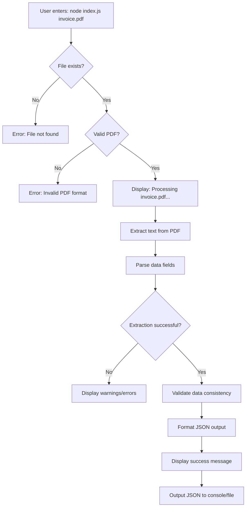
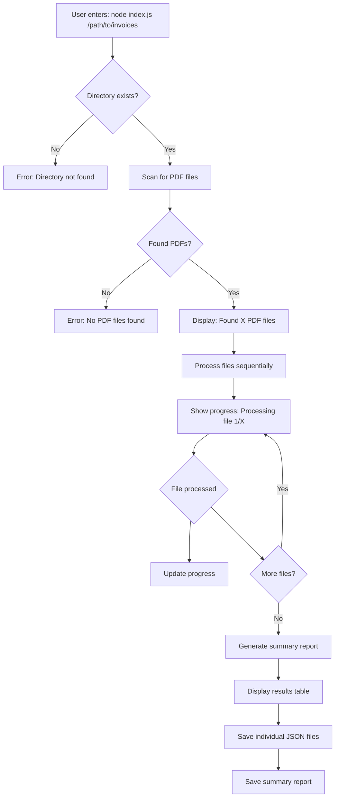
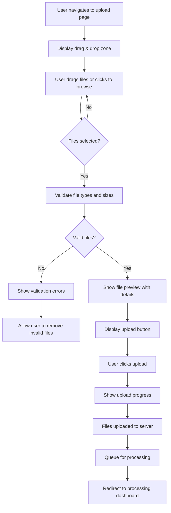

# Amazon Invoice Parser UI/UX Specification

## Introduction

This document defines the user experience goals, information architecture, user flows, and visual design specifications for Amazon Invoice Parser's user interface. It serves as the foundation for visual design and frontend development, ensuring a cohesive and user-centered experience.

The Amazon Invoice Parser currently exists as a command-line utility but includes plans for future web-based interfaces to support batch processing visualization and drag-and-drop file uploads.

## Overall UX Goals & Principles

### Target User Personas

**Power User/Developer:** Technical professionals who need command-line integration and batch processing capabilities for automated workflows and programmatic access to invoice data.

**Business Professional:** Accountants, bookkeepers, and small business owners who need reliable expense tracking and tax preparation tools with both CLI and web interface options.

**Individual Consumer:** Frequent Amazon shoppers who want to track personal spending patterns and generate expense reports, preferring user-friendly web interfaces.

### Usability Goals

- **Command-line Efficiency:** Power users can process invoices with minimal command complexity and clear, predictable output
- **Web Interface Simplicity:** Non-technical users can upload and process invoices through an intuitive drag-and-drop interface
- **Processing Transparency:** Users receive clear feedback about processing status, errors, and results regardless of interface
- **Data Trust:** Users can confidently rely on extraction accuracy with clear validation indicators and error reporting

### Design Principles

**Clarity over cleverness** - Prioritize clear communication and predictable behavior over innovative but potentially confusing interactions

**Progressive disclosure** - Show essential information first, with advanced options and detailed results available on demand

**Consistent patterns** - Use familiar command-line conventions and web UI patterns throughout both interfaces

**Immediate feedback** - Every action should have a clear, immediate response with progress indicators for long-running operations

**Accessible by default** - Design for all users from the start, ensuring both CLI accessibility and WCAG AA compliance for web interfaces

## Change Log

| Date | Version | Description | Author |
|------|---------|-------------|---------|
| 2025-12-07 | v1.0 | Initial frontend specification covering CLI and future web interface | UX Expert |

## Information Architecture (IA)

### Site Map / Screen Inventory

```mermaid
graph TD
    A[Command Line Interface] --> B[Help Command]
    A --> C[Single File Processing]
    A --> D[Batch Directory Processing]
    A --> E[Processing Status/Output]
    A --> F[Error Messages]

    G[Future Web Interface] --> H[File Upload Page]
    G --> I[Processing Dashboard]
    G --> J[Results View]
    G --> K[Reports & Analytics]
    G --> L[Settings]

    H --> H1[Drag & Drop Zone]
    H --> H2[File Preview]
    H --> H3[Upload Progress]

    I --> I1[Processing Queue]
    I --> I2[Real-time Status]
    I --> I3[Individual File Progress]

    J --> J1[Parsed Data Table]
    J --> J2[JSON Export]
    J --> J3[Validation Warnings]

    K --> K1[Spending Reports]
    K --> K2[Category Analysis]
    K --> K3[Time Period Filters]
```

### Navigation Structure

**Command-line Navigation:** Hierarchical command structure with clear help system
- Primary: Core commands (`process`, `batch`, `report`)
- Secondary: Options and flags (`--output`, `--format`, `--verbose`)
- Breadcrumb: Command history and current operation context

**Web Navigation:** Single-page application with clear section navigation
- Primary: Main sections (Upload, Processing, Results, Reports)
- Secondary: Settings and account management
- Breadcrumb: Current workflow step indication

## User Flows

### Single Invoice Processing (CLI)

**User Goal:** Extract data from a single Amazon invoice PDF quickly and reliably

**Entry Points:** Command line with file path argument

**Success Criteria:** JSON output written to file or console with >95% extraction accuracy

**Flow Diagram:**

**Edge Cases & Error Handling:**
- File not found: Clear error message with file path verification
- Corrupted PDF: Graceful failure with suggestion to check file integrity
- Unsupported format: Message indicating format limitations
- Partial extraction: Warning about missing fields with partial data output
- Large file: Progress indicator for files over 5MB

**Notes:** Processing should complete in under 5 seconds with immediate feedback on success/failure.

### Batch Directory Processing (CLI)

**User Goal:** Process multiple invoice PDFs efficiently with summary reporting

**Entry Points:** Command line with directory path argument

**Success Criteria:** All valid PDFs processed with summary report showing success/failure counts

**Flow Diagram:**

**Edge Cases & Error Handling:**
- Mixed file types: Skip non-PDF files with warning
- Processing failures: Continue with other files, track failures in summary
- Permission issues: Clear error messages for file access problems
- Large batches: Memory usage monitoring with warnings for >100 files

**Notes:** Progress indication crucial for batches. Summary should include processing time, success rate, and error details.

### Web Interface File Upload Flow

**User Goal:** Upload and process multiple invoice files through an intuitive web interface

**Entry Points:** Web browser navigation to upload page

**Success Criteria:** Files uploaded successfully and queued for processing

**Flow Diagram:**

**Edge Cases & Error Handling:**
- Browser compatibility: Fallback to traditional file input
- Large files: Client-side size validation before upload
- Network issues: Resume capability and error recovery
- File conflicts: Duplicate handling and user confirmation

**Notes:** Drag and drop should work on desktop and mobile. File preview should show name, size, and type.

## Wireframes & Mockups

### Design Files

**Primary Design Files:** Figma project (to be created) - Amazon Invoice Parser UI Kit
- Link: [Figma Design File URL - TBD]

### Key Screen Layouts

#### Command Line Interface Help Screen

**Purpose:** Provide clear usage instructions and available options

**Key Elements:**
- Usage syntax with examples
- Available commands and flags
- Common error scenarios and solutions
- Version information

**Interaction Notes:** Help should be accessible via `--help` or `-h` flags with formatted, readable output.

**Design File Reference:** CLI-Help-Screen.fig

#### Web Upload Interface

**Purpose:** Allow users to easily select and upload invoice files for processing

**Key Elements:**
- Large drag & drop zone with visual feedback
- File browser button as fallback
- File list with preview, size, and remove options
- Upload progress indicators
- Clear call-to-action buttons

**Interaction Notes:** Hover states on drop zone, file type validation feedback, upload progress animation.

**Design File Reference:** Web-Upload-Interface.fig

#### Processing Dashboard

**Purpose:** Show real-time status of batch processing operations

**Key Elements:**
- Processing queue with file names and status
- Progress bars for individual files and overall batch
- Time estimates and completion percentages
- Error indicators with expandable details
- Pause/cancel options for long-running batches

**Interaction Notes:** Auto-refresh status, expandable error details, ability to prioritize urgent files.

**Design File Reference:** Processing-Dashboard.fig

#### Results View

**Purpose:** Display parsed invoice data in a clear, actionable format

**Key Elements:**
- Tabular view of extracted data fields
- Validation status indicators (success/warning/error)
- Expandable raw JSON view
- Export options (JSON, CSV, PDF)
- Summary statistics (total processed, accuracy rate)

**Interaction Notes:** Sortable columns, filter by status, bulk export capabilities.

**Design File Reference:** Results-Data-Table.fig

## Component Library / Design System

### Design System Approach

**Approach:** Use a lightweight, accessible design system optimized for data-heavy interfaces. Start with a modified version of a popular open-source system (like Material Design Web) adapted for our specific use case, rather than building entirely from scratch. This ensures consistency, accessibility, and faster development while maintaining our utility-focused aesthetic.

### Core Components

#### Data Table Component

**Purpose:** Display structured invoice data with sorting, filtering, and export capabilities

**Variants:** Basic table, expandable rows, selectable rows

**States:** Loading, empty, error, success with validation warnings

**Usage Guidelines:** Always include column headers, show row count, provide pagination for large datasets

#### File Upload Component

**Purpose:** Handle file selection and upload with progress indication

**Variants:** Drag & drop zone, traditional file input, multi-file selection

**States:** Default, drag-over, uploading, success, error

**Usage Guidelines:** Show file type restrictions, size limits, and progress feedback

#### Progress Indicator Component

**Purpose:** Show processing status for long-running operations

**Variants:** Linear progress bar, circular spinner, step indicator

**States:** Indeterminate (unknown duration), determinate (known progress), paused, error

**Usage Guidelines:** Include time estimates when possible, show completion percentage

#### Status Badge Component

**Purpose:** Indicate validation status and processing results

**Variants:** Success, warning, error, info

**States:** Default, hover, selected

**Usage Guidelines:** Use consistent color coding, include icons, keep text concise

## Branding & Style Guide

### Visual Identity

**Brand Guidelines:** Clean, professional utility aesthetic focusing on data clarity and operational efficiency rather than decorative elements. Open-source project with minimal branding to maintain trust and neutrality.

### Color Palette

| Color Type | Hex Code | Usage |
|------------|----------|--------|
| Primary | #1976D2 | Main action buttons, active navigation, primary links |
| Secondary | #757575 | Secondary actions, muted text, borders |
| Accent | #FF9800 | Highlights, warnings, progress indicators |
| Success | #4CAF50 | Positive feedback, successful operations, validation confirmations |
| Warning | #FF9800 | Cautions, partial successes, non-critical issues |
| Error | #F44336 | Errors, failed operations, critical validation issues |
| Neutral | #9E9E9E, #E0E0E0, #F5F5F5 | Text hierarchy, backgrounds, subtle dividers |

### Typography

#### Font Families
- **Primary:** Roboto (system font stack with fallbacks)
- **Secondary:** Roboto Condensed (for data tables and compact displays)
- **Monospace:** Roboto Mono (for code examples and technical output)

#### Type Scale
| Element | Size | Weight | Line Height |
|---------|------|--------|-------------|
| H1 | 2rem (32px) | 300 | 1.2 |
| H2 | 1.5rem (24px) | 400 | 1.3 |
| H3 | 1.25rem (20px) | 400 | 1.4 |
| Body | 1rem (16px) | 400 | 1.5 |
| Small | 0.875rem (14px) | 400 | 1.4 |

### Iconography

**Icon Library:** Material Design Icons - comprehensive, accessible, and familiar to most users

**Usage Guidelines:** Use outline style for inactive states, filled for active states. Maintain 24x24px touch targets. Include text labels for clarity.

### Spacing & Layout

**Grid System:** 8px base unit with standard Material Design breakpoints

**Spacing Scale:** 4px, 8px, 16px, 24px, 32px, 48px, 64px, 96px, 128px

## Accessibility Requirements

### Compliance Target

**Standard:** WCAG 2.1 AA compliance for all web interfaces, with Section 508 considerations for government users

### Key Requirements

**Visual:**
- Color contrast ratios: 4.5:1 minimum for normal text, 3:1 for large text
- Focus indicators: 2px solid outline with 2:1 contrast ratio
- Text sizing: Support browser zoom up to 200% without horizontal scrolling

**Interaction:**
- Keyboard navigation: All functionality accessible via keyboard only
- Screen reader support: Proper ARIA labels, semantic HTML structure
- Touch targets: Minimum 44x44px for mobile interfaces

**Content:**
- Alternative text: Descriptive alt text for all images and icons
- Heading structure: Logical H1-H6 hierarchy for screen readers
- Form labels: Explicit labels for all form inputs with error associations

### Testing Strategy

Automated accessibility testing with axe-core during development, manual testing with screen readers, and user testing with assistive technology users. Include accessibility checklist in QA process.

## Responsiveness Strategy

### Breakpoints

| Breakpoint | Min Width | Max Width | Target Devices |
|------------|-----------|-----------|----------------|
| Mobile | 320px | 767px | Phones in portrait/landscape |
| Tablet | 768px | 1023px | Tablets, small laptops |
| Desktop | 1024px | 1439px | Laptops, desktops |
| Wide | 1440px | - | Large displays, ultrawide monitors |

### Adaptation Patterns

**Layout Changes:** Single column on mobile, multi-column grid on desktop. Data tables become card layouts on small screens.

**Navigation Changes:** Collapsible hamburger menu on mobile, persistent sidebar on desktop. Tab-based navigation for complex workflows.

**Content Priority:** Essential information (file status, actions) prioritized on small screens. Secondary details (metadata, timestamps) hidden by default.

**Interaction Changes:** Touch-friendly button sizes on mobile, hover states on desktop. Swipe gestures for mobile navigation.

## Animation & Micro-interactions

### Motion Principles

Subtle, purposeful animations that provide feedback without being distracting. Focus on perceived performance and user reassurance during processing operations.

### Key Animations

- **File Upload:** Smooth fade-in for file list items, bouncy success checkmark
- **Processing Progress:** Smooth progress bar fills with easing, pulsing indicator for indeterminate states
- **Status Changes:** Color transitions for status badges, slide-in for error messages
- **Page Transitions:** Subtle fade transitions between main sections
- **Button Interactions:** Scale transform on press, ripple effect for material design consistency

## Performance Considerations

### Performance Goals

- **Page Load:** Under 2 seconds for initial web interface load
- **File Upload:** Smooth handling of files up to 10MB without blocking UI
- **Processing Feedback:** Real-time status updates without performance impact
- **Animation FPS:** 60fps for all animations and transitions

### Design Strategies

Progressive loading of components, optimistic UI updates for better perceived performance, efficient data table virtualization for large result sets, and background processing with proper status indication.

## Next Steps

### Immediate Actions
1. Create Figma design system file with component library
2. Develop HTML/CSS prototype of upload interface
3. Test CLI interface usability with target users
4. Create wireframe mockups for processing dashboard
5. Research accessibility testing tools and processes

### Design Handoff Checklist
- [ ] All user flows documented and validated
- [ ] Component inventory complete with variants and states
- [ ] Accessibility requirements defined and testable
- [ ] Responsive strategy clear with breakpoint definitions
- [ ] Brand guidelines established and approved
- [ ] Performance goals established with design implications
- [ ] Design system approach selected and justified
- [ ] Key screen layouts wireframed and reviewed
- [ ] Animation principles defined for development guidance
- [ ] Technical constraints documented for development team

## Checklist Results

### UX Specification Checklist Execution Results

**✅ User Research & Understanding**
- [x] User personas defined based on PRD requirements
- [x] Pain points and goals clearly articulated
- [x] Technical constraints understood and incorporated
- [x] Both CLI and web interface needs addressed

**✅ Information Architecture**
- [x] Clear navigation structure for both interfaces
- [x] Logical grouping of functionality
- [x] Scalable architecture for future features
- [x] User mental models considered

**✅ User Flows & Interactions**
- [x] Critical user tasks identified and documented
- [x] Error states and edge cases covered
- [x] Success criteria clearly defined
- [x] Performance considerations included

**✅ Visual Design Foundation**
- [x] Design system approach selected
- [x] Color palette and typography defined
- [x] Component library planned
- [x] Accessibility standards established

**✅ Technical Feasibility**
- [x] Responsive design strategy defined
- [x] Performance goals realistic
- [x] Browser compatibility considered
- [x] Mobile experience planned

**✅ Implementation Readiness**
- [x] Design handoff checklist complete
- [x] Next steps clearly defined
- [x] Stakeholder review process outlined
- [x] Open questions identified